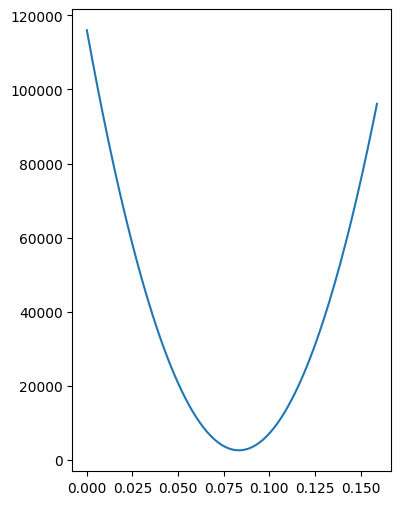
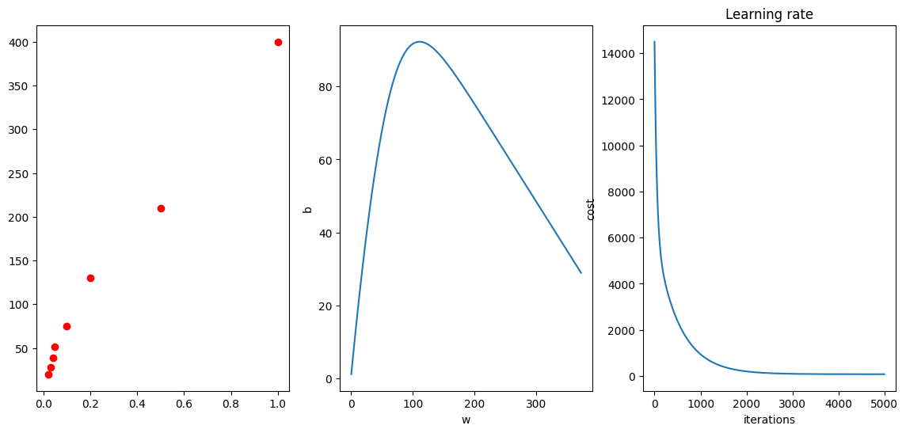

# Linear Regression (One Feature and m Training Examples)
In linear regression, we intend to fit a straight line from the given data if there is only one feature. So, we assume a function which generalizes one straight line.

## Linear Model: Input and Output
In some of the text, we call this assumed linear function as hypothesis as hypothesis is an idea that is suggested as the possible explanation for something but has not yet been found to be true or correct.

If we use $\mathbf{𝐱^{(𝐢)}}$  to denote the feature vector for $\mathbf{i^{th}}$ training example and $w$ and $b$ as the model parameters, we can write the hypothesis as below:

$h(x)=wx^{(i)}+b$

Let us have $m$ training example then  $𝐢=1,2,3,...m$ and write $\hat{y}$ for the prediction from the hypothesis.

$\hat{y}^{(i)} = wx^{(i)}+b $

### Example Data

| Size | Price (L) |
| :---:|   :---:   |
| 100  | 20  |
| 150  | 28  |
| 200  | 39  |
| 250  | 51  |
| 500  | 75  |
| 1000 | 130 |
| 2500 | 210 |
| 5000 | 400 |

$m=8; nx=1$

Import the required modules
```js
import numpy as np
from matplotlib import pyplot as plt
```

```js
price=np.array([20, 28, 39, 51, 75, 130, 210, 400])
size=np.array([100, 150, 200, 250, 500, 1000, 2500, 5000])
print(price,"\n", size)
```
## Setting the Matrices as per Notation
For $nx$ features and $m$ training examples, we can write the linear model as below:

$\hat{\mathbf{y}} = \mathbf{w^T X+b}$

The correct matrix notations are explained as under:

- We arrange all featues of a particular training example vertically in a column and arrange all training examples horizontally or stack all training examples in different columns. So the shape of the feature vector of a training example ($\mathbf{x}$) is $(nx,1)$ and the shape of feature matrix ($\mathbf{X}$) is $(nx, m)$.

> $\mathbf{x}$.shape=($nx, 1$); $\mathbf{X}$.shape=($nx, m$)

- The labels of the data are also arranged in the same manner. There is only one label for one input data set. So, there would be a single row and we arrange all the labels for training examples horizontally or stack them in different columns. This gives the shape of output vector ($\mathbf{y}$) as $(1, m)$

> $\mathbf{y}$.shape=($1,m$)

- The weight matrix $\mathbf{w}$ and $\mathbf{b}$ are arranged as per below shapes to facilitate the vector and broadcasting operation.

> $\mathbf{w}$.shape=($nx,1$)

> $\mathbf{b}$.shape=($1,1$)

It is just to reiterate that we write $\hat{\mathbf{y}} = \mathbf{w^T X+b}$ for all the training examples and we write the prediction as $\hat{y} = \mathbf{w^T x+b}$ for a particular training example.
 In this case, the shape of the $\mathbf{x}$ is $(nx,1)$ and for one feature it would be $(1,1)$.

#Calculate Number of Examples (m) and Features (nx)

```js
nx=1
m=size.shape[0]

#Reshaping the Input
X=size.reshape(nx,m)
y=price.reshape(1,m)

#Initializing Weights and Biases
w=np.random.rand(nx).reshape(nx,1)
b=np.random.rand(nx).reshape(1,1)
```
We feed training set to the learning algorithm. The algorithm then computes a linear function f(x) that takes size of a house as input and tries to output the estimated price of y for the corresponding house.

Let us substitute the data


$\hat{y}^{(1)} = wx^{(1)}+b = w(100)+b $      `First Training Example`.

$\hat{y}^{(2)} = wx^{(2)}+b = w(150)+b $      `Second Training Example`.

.....

$\hat{y}^{(8)} = wx^{(8)}+b = w(5000)+b $     `Eighth Training Example`

```js
def linear(X,w,b):
  return np.dot(w.T,X)+b
```

Call the function

```js
yhat=linear(X,w,b)
print(yhat.shape)
```
## Cost Function

In linear regression, we have to come up with parameters w and b so that the straight line fits the data well.
- Choose $w$ and $b$ so that $\hat{y}$ is close to y for all values of x
- ($\hat{y}-y)$ is the difference between output price of the house from the hypothesis and the actual price of the house.
- So, the objective function for this minimization problem can be formulated as below

 $J(w,b)=\frac{1}{2m}\sum \limits _{i=1} ^{m} (\hat{y}-y)^{2} $

- The cost function sometimes called as “Squared error function” or "Mean squared error".
- The objective function $J(w,b)$ for this optimization problem is also called as “Cost function” in linear regression.


**Our aim is to minimize the cost function,** $J(w,b)$

```js
def cost(x,y,w,b):
  yhat=linear(x,w,b)
  #print(yhat.shape, y.shape)
  error=np.subtract(yhat,y)
  #print(error, error.shape)
  error_squared=np.power(error,2)
  J=np.sum(error_squared, axis=1)
  #J=np.sum(np.multiply((yhat-y), (yhat-y)), axis=1)
  #J=np.dot((yhat-y), (yhat-y).T)
  return J/(2*x.shape[0]) # x.shape[0] is equal to m
```
Call cost function

```js
cost(X, y, np.array([0.1]),0)
```

```js
plt.rcParams['figure.figsize']=(14, 6)

#initialize array to store J for plotting
plotJ=np.array([0,0])
for i in range(160):
  J=cost(X, y, np.array([(i/1000,0)]),0) # Call cost function to calculate the cost for assumed weight (i/1000)
  plotJ=np.vstack((plotJ,[i/1000,J[0]])) # Stack the value of the w and the cost in plotJ array
  #print(i/100,y,J)
  # print(J)
#plotJ
ax1=plt.subplot(131)
plt.plot(plotJ[1:,0], plotJ[1:,1])
```


Minimum Loss and its corresponding weight
```js
minLoss=np.min(plotJ[1:,1])
print(minLoss, np.where(plotJ[1:,1] == minLoss))
```

## Gradient Descent

$ \frac{\partial J}{\partial w} = \frac{1}{m} \sum \limits _{i=1} ^m (\hat {y}^{(i)}-y^{(i)})x$

$ \frac{\partial J}{\partial b} = \frac{1}{m} \sum \limits _{i=1} ^m (\hat {y}^{(i)}-y^{(i)})$

**Updating Parameters**

> $\mathbf{w} := \mathbf{w} - \alpha \frac {\partial{\mathbf{J}}}{\partial {\mathbf{w}}}$

> ${\mathbf{b}} := {\mathbf{b}} - \alpha \frac {\partial {\mathbf{J}}}{\partial {\mathbf{b}}}$

Where,
    $ \alpha$ : Learning Rate (0.0001, 0.001, 0.01...).

Update parameters simultaneously for correct implementation of Gradient Descent

## Normalization
```js
X_norm=X/np.max(X)
X_norm.shape
```
## Python implementation

1. Arrange the input feature matrix $ \mathbf{X}.shape = (nx \times m)$
2. Arrange the output vector $\mathbf{y}.shape=(1 \times m)$
3. Assume learning rate and number of iterations
4. Initialize the weight vector $\mathbf{w}.shape=(nx \times 1)$ We can initialize these with `zeros` for linear regression.
5. Initialize the bias as zero (scalar or 1D of size 1 or 2D array or size 1,1)
6. Loop over iteration
- (a) Calculate predicted value array for assumed/updated parameters
$ \mathbf{\hat{y}}=\mathbf{w}^{T}\mathbf{X}+b$
- (b) Calculate the loss $J(w,b)=\frac{1}{2m}\sum \limits _{i=1} ^{m} (\hat{y}^{(i)}-y^{(i)})^{2} $
- (c) Calculate the partial derivative of Cost Function with
respect to weights
$ \frac{\partial J}{\partial w} = \frac{1}{m} \mathbf{X}(\mathbf{\hat {y}-y})^T$
- (d) Calculate the partial derivative of Cost Function with respect to bias. This is evaluated by summing the difference of predicted value and actual value and taking mean.
$ \frac{\partial J}{\partial b} = \frac{1}{m} Sum(\mathbf{\hat {y}-y})^T$
- (e) Update the weight and bias


> $\mathbf{w} := \mathbf{w} - \alpha \frac {\partial{\mathbf{J}}}{\partial {\mathbf{w}}}$

> $ {\mathbf{b}} := {\mathbf{b}} - \alpha \frac {\partial {\mathbf{J}}}{\partial {\mathbf{b}}}$

## Final Code

```js
learning_rate=0.01
max_iteration=5000
cost=np.zeros((max_iteration))
wPlot=np.zeros((max_iteration))
bPlot=np.zeros((max_iteration))
#print(X_norm)
w=np.zeros(1).reshape(1,1)
b=np.zeros(1).reshape(1,1)
for i in range(max_iteration):
  yhat=linear(X_norm,w,b)
  error=np.subtract(yhat,y)
  #print(error, error.shape)
  error_squared=np.power(error,2)
  #J=np.sum(error_squared, axis=1)
  #J=np.sum(np.multiply((yhat-y), (yhat-y)), axis=1)
  J=np.dot((yhat-y), (yhat-y).T)
  cost[i]=J/(2*m)
  #print(cost[i])
  dw_sum=np.sum((yhat-y)*X_norm,axis=1)
  #print("dw_sum ", dw_sum)
  dw=dw_sum/m
  #dw=(1/X_norm.shape[0])*np.dot(X_norm,(yhat-y).T)
  db=np.sum((yhat-y), axis=1)/m
  w=w-learning_rate*dw
  b=b-learning_rate*db
  #print(b.shape)
  wPlot[i]=w
  bPlot[i]=b
print(w, b)
```
## Code for Plotting Data

```js
ax1=plt.subplot(131)
plt.scatter(X_norm,y,color="red")
ax2=plt.subplot(132)
plt.xlabel('w')
plt.ylabel('b')
ax2.plot(wPlot,bPlot)
# Plot learning curve (with costs)
ax3=plt.subplot(133)
plt.plot(cost)
plt.ylabel('cost')
plt.xlabel('iterations')
plt.title("Learning rate")
plt.show()
```


The output weight can be converted using the following analysis.

$$ w'=\frac {dy}{d\bar{X}} = \frac {dy}{\frac{dX}{X_{max}}} = w'$$
$$  w' = \frac {dy{X_{max}}}{dX} = w X_{max}$$
$$  w = \frac {w'}{X_{max}}$$

```js
def predict(w,b,x):
  return w*x+b
```

```js
price=predict(w_model,b,4500)
print(price)
```
## Linear Regression using `MatplotLib`

```js
X_mpl=X.flatten()
y_mpl=y.flatten()
```

```js
# Using Matplotlib function for linear fiiting
plt.scatter(X_mpl,y_mpl,color="red")
linear_model=np.polyfit(X_mpl,y_mpl,1)
hypothesis =np.poly1d(linear_model)
print(hypothesis)
plt.plot(X_mpl,hypothesis(X_mpl))
plt.show()
```
## Linear Regression using `SKLearn`

```js
from sklearn import linear_model
X=np.array([[100],[150],[200],[250],[500], [1000],[2500],[5000]])
y=np.array([20,28, 39, 51, 75, 130, 210, 400])
```

```js
# Create a Logistic Regression Object, perform Logistic Regression
lr = linear_model.LinearRegression()
lr.fit(X, y)
print(lr.coef_)
print(lr.intercept_)
```
